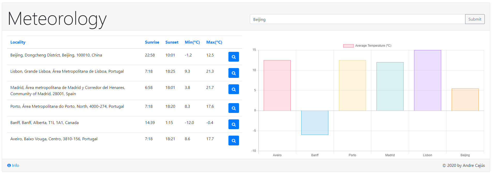
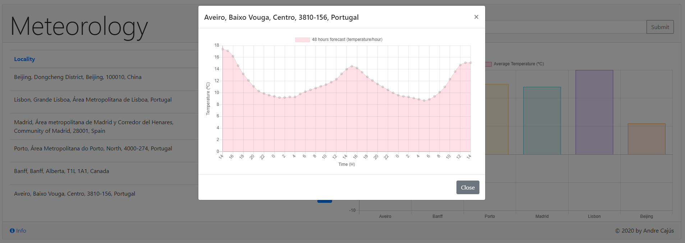

### Weather APP

### Setup
1) Install the dependencies present in the “package.json”;
2) Run the server.js on the main directory “node .\server.js” 
3) Open browser on "http://localhost:8080/";
4) Be aware of the API public keys, there is a maximum of requests;
5) Keys are stored on the .env file, change them if needed (API keys).

### API keys
To change the keys it is possible to register and get them at:
1) geolocation = "https://locationiq.com/";
2) weather = "https://darksky.net/".

### Functionalities 
1) It is possible to add 10 localities without repetitions; 
2) The input it is not case-sensitive; 
3) It is possible to sort the table by column (string, time, decimal); 
4) The main graph displays the average temperatures; 
5) The city modals, shows the temperature graphs for the next 48 hours; 
6) The webpage provides a responsive Bootstrap interface. 

### Implementation 
1) This client page works with an internal nodejs API that uses 2 external APIs; 
2) One API is for geolocation (locationiq), and the other is for the weather info (darksky); 
3) There are 2 main get methods (‘/forecast/daily/:city’ & ‘/forecast/hourly/:lat/:lon’); 
5) The internal API stores the log entries for each operation (nedb); 
5) The API keys are stored (.env file); 
6) The index.html contains all the logic including the JS; 
7) I tested The interface on chrome and Firefox.

### Images

1) Main

2) Locality 48h forecast

